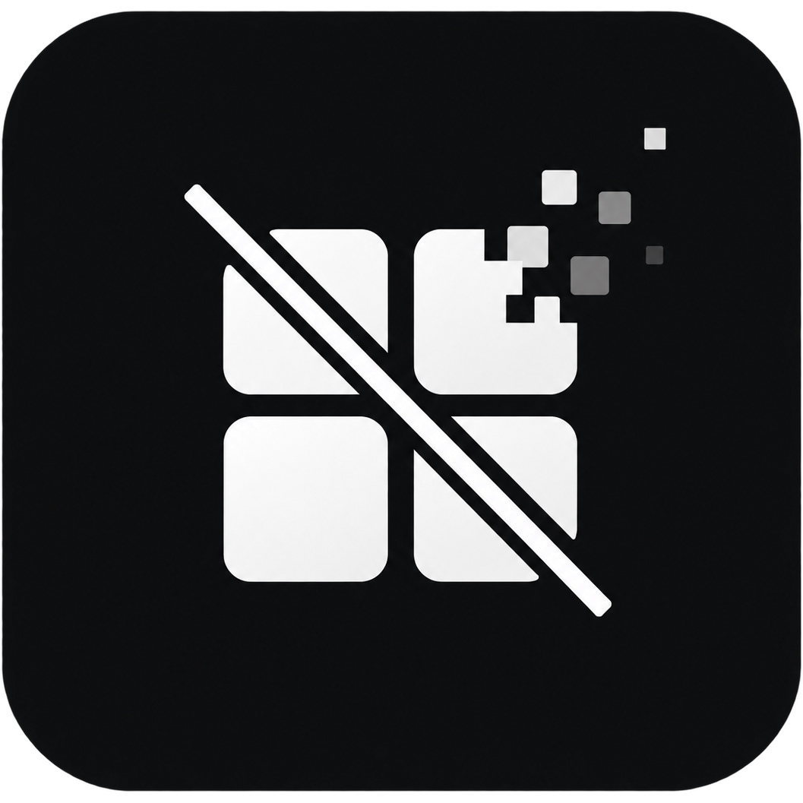

<p align="center">
  
</p>

<h1 align="center">留景</h1>

<p align="center">WallpaperQuiet · 把桌面留给壁纸。</p>
<p align="center">停下操作，桌面图标与任务栏轻轻隐去；移动鼠标或按下键盘，它们便重新出现。</p>

<p align="center">
  
  <br><sub>设置窗口保持打开，也能继续静享。</sub>
</p>

<p align="center">
  
  <br><sub>让动态壁纸继续流动，让桌面在需要时回来。</sub>
</p>

<p align="center">
  <a href="https://github.com/SUEaCZQ/wallpaper-quiet/releases/latest"><strong>下载安装包</strong></a>
  &nbsp; · &nbsp;
  <a href="https://github.com/SUEaCZQ/wallpaper-quiet/releases/download/v1.3.2/wallpaper-quiet-1.3.2-source.zip">下载源码</a>
  &nbsp; · &nbsp;
  <a href="https://github.com/SUEaCZQ/wallpaper-quiet/issues">反馈问题</a>
</p>

## 安静，但随时可用

- **空闲渐隐，输入恢复**：分别控制桌面图标和任务栏，调整等待时间与渐隐时长。
- **动态壁纸持续播放**：直接调整桌面合成图层的透明度，不用静态截图覆盖 Wallpaper Engine。
- **设置窗口也能静享**：打开设置不会暂停已经开启的静享；关闭窗口则收起到托盘。
- **屏幕占满保护**：检查所有屏幕上的应用，而不只检查前台窗口。应用全屏、无边框全屏、最大化，或多个分屏窗口合起来占满任意一块屏幕时，都保持桌面与任务栏显示。
- **登录后自动运行**：可以随 Windows 登录收起到托盘，并自动开启静享。
- **随时恢复**：按 `Ctrl + Alt + F12` 或使用托盘菜单，恢复桌面并暂停静享。正常退出也会恢复桌面。

## 下载与安装

在 [Releases](https://github.com/SUEaCZQ/wallpaper-quiet/releases/latest) 下载：

| 文件 | 用途 |
| --- | --- |
| `WallpaperQuiet-1.3.2-Setup-x64.exe` | Windows 64 位安装包，内置 .NET 桌面运行环境，无需另行安装运行库 |
| `wallpaper-quiet-1.3.2-source.zip` | 此版本的源代码、图标、演示与构建脚本 |
| `SHA256SUMS.txt` | 安装包与源码包的 SHA-256 校验值 |

1. 运行安装包，按向导安装到当前用户的应用目录，无需管理员权限。
2. 按需选择「开机自启动」和「桌面快捷方式」。自启动默认勾选，登录后等待 10 秒，在托盘中自动开启静享。
3. 打开留景，点击「开始静享」。调整设置后，点击「保存并继续」。

适用于 Windows 10 / 11 x64，主要在 Windows 11 与 Wallpaper Engine 环境验证。安装包目前未进行代码签名。升级安装保留现有设置；卸载会移除属于此安装位置的登录任务，保留个人设置，方便重新安装。

## 默认配置

首次使用的默认值如下；已有用户保留自己的配置。演示中的等待时间可以自行调整。

| 设置 | 默认值 |
| --- | --- |
| 空闲等待 | 5 秒 |
| 渐隐时长 | 600 毫秒 |
| 输入后渐现 | 250 毫秒 |
| 桌面图标 / 任务栏 | 均开启 |
| 仅在桌面时运行 | 关闭，允许设置窗口保持打开 |
| 渐隐与渐现 | 开启，并遵循系统减少动画设置 |
| 登录启动方式 | 收起到托盘，并自动开启静享 |
| 全屏 / 最大化 / 分屏占满保护 | 始终开启 |

配置保存在 `%LOCALAPPDATA%\WallpaperQuiet\settings.json`。应用内的「开机自启动」开关会立即写入并验证 Windows 当前用户的登录任务，不保存账户密码。

## 保护规则与兼容性

后台被普通窗口遮挡的应用也参与保护判断。最小化、隐藏、其他虚拟桌面上被系统标记为不可见的窗口，以及桌面和动态壁纸图层不参与判断。

左右各半、上下分屏、三窗口、四宫格等布局，只要窗口合起来覆盖某块屏幕的可用区域，就暂停渐隐；不要求某一个窗口处于全屏或最大化状态。任务栏占用的区域不算空缺，跨屏窗口按各屏实际覆盖区域计算。多个窗口重叠在同一处不会重复计数，单个半屏窗口或仍露出明显壁纸空隙的布局不会触发占满保护。边框取整容许 2 个物理像素的误差。

检测到屏幕被占满时，已经渐隐的图标与任务栏会立即恢复。窗口移开或最小化、屏幕重新留出空白后，再重新计算空闲等待时间。

渐隐期间只改变透明度，不反复隐藏、显示或重建桌面窗口；暂停和退出时恢复原始状态。独立恢复进程会在主程序异常退出时尝试还原桌面，但无法覆盖两个进程同时被强制结束、系统崩溃或资源管理器自身异常。

Windows 的桌面窗口层级可能随系统更新变化。不同 Wallpaper Engine 版本、HDR 和所有多屏组合尚未逐一验证；遇到问题可在 Issues 中说明系统版本、显示器情况和复现步骤。

## 从源码构建

需要 Windows、[.NET 10 SDK](https://dotnet.microsoft.com/download/dotnet/10.0)，制作安装包还需要 [Inno Setup 6.7 或更高版本](https://jrsoftware.org/isdl.php)。

```powershell
# 编译应用
dotnet build -c Release

# 桌面合成、UI、登录启动和全屏判断检查
.\bin\Release\net10.0-windows\WallpaperQuiet.exe --self-test
.\bin\Release\net10.0-windows\WallpaperQuiet.exe --ui-tests

# 生成包含运行环境的 x64 安装包
.\scripts\build-release.ps1 -IsccPath 'C:\Program Files (x86)\Inno Setup 6\ISCC.exe'

# 从已提交的版本生成源码 ZIP 与校验文件（需要 Git 仓库）
.\scripts\package-source.ps1 -Ref HEAD
```

产物位于 `artifacts/release/`。源码包从指定 Git 提交生成，仅包含已跟踪文件，不打包本机配置、日志、快捷方式、历史备份、编译缓存或 Git 凭据。

其他命令：`--diagnose-protection` 查看当前保护原因；`--restore` 恢复并暂停；`--quit` 正常退出。请在应用中更改自启动设置；手动移动程序后，应在新位置重新关闭再开启自启动。

## 开源许可

代码采用 [MIT License](LICENSE)。欢迎提交问题与改进。演示中的壁纸及第三方软件标识归各自权利人所有，演示素材不代表随本项目授予其使用许可。
